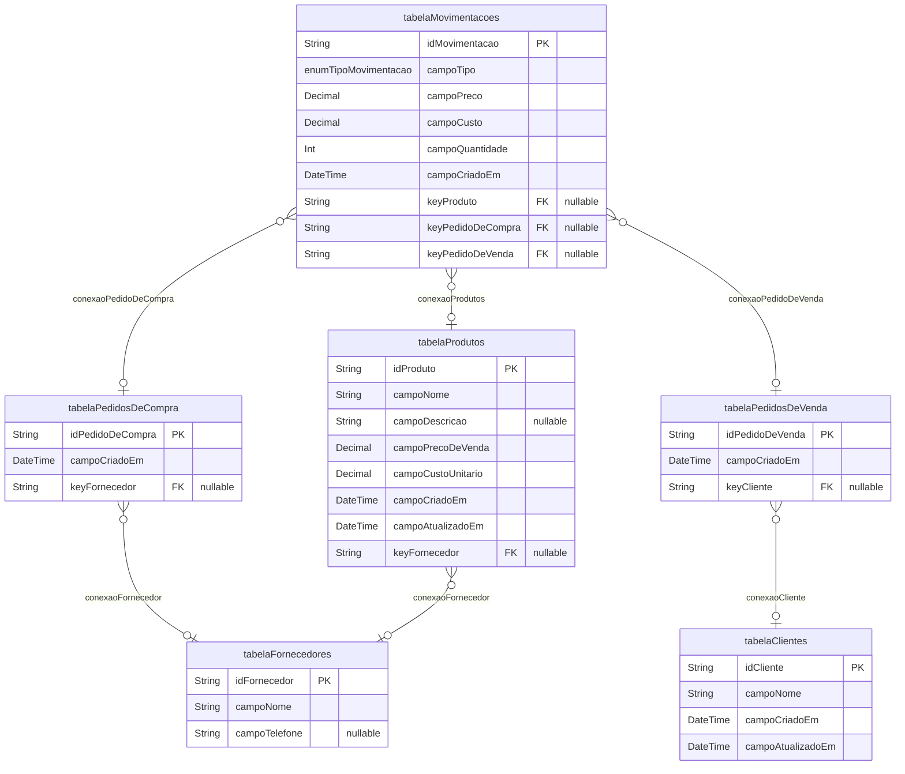

# BANCO DE DADOS

> Generated by [`prisma-markdown`](https://github.com/samchon/prisma-markdown)

- [default](#default)

## default

### `tabelaClientes`

Properties as follows:

- `idCliente`:
- `campoNome`:
- `campoCriadoEm`:
- `campoAtualizadoEm`:

### `tabelaFornecedores`

Properties as follows:

- `idFornecedor`:
- `campoNome`:
- `campoTelefone`:

### `tabelaMovimentacoes`

Properties as follows:

- `idMovimentacao`:
- `campoTipo`:
- `campoPreco`:
- `campoCusto`:
- `campoQuantidade`:
- `campoCriadoEm`:
- `keyProduto`:
- `keyPedidoDeCompra`:
- `keyPedidoDeVenda`:

### `tabelaPedidosDeCompra`

Properties as follows:

- `idPedidoDeCompra`:
- `campoCriadoEm`:
- `keyFornecedor`:

### `tabelaPedidosDeVenda`

Properties as follows:

- `idPedidoDeVenda`:
- `campoCriadoEm`:
- `keyCliente`:

### `tabelaProdutos`

Properties as follows:

- `idProduto`:
- `campoNome`:
- `campoDescricao`:
- `campoPrecoDeVenda`:
- `campoCustoUnitario`:
- `campoCriadoEm`:
- `campoAtualizadoEm`:
- `keyFornecedor`:
